# TailAdmin Laravel – DevOps Deployment Project

## Project Overview

This project demonstrates a production-style deployment architecture for the TailAdmin Laravel application using:

- Dockerized Laravel application
- AWS EC2
- AWS RDS (MySQL)
- GitHub Actions CI/CD
- Amazon ECR
- Blue/Green Deployment Strategy
- Nginx Reverse Proxy
- Custom AWS VPC Networking
- IAM Role-Based Authentication
- AWS Secrets Manager
- Future-ready AWS CodePipeline & CodeDeploy integration

Repository Used:

```bash
https://github.com/TailAdmin/tailadmin-laravel
```

---

# Architecture Overview

## Current Active CI/CD

Primary deployment pipeline:

```text
GitHub Actions
           ↓
Build & Test Application
           ↓
Build Docker Image
           ↓
Push Image to Amazon ECR
           ↓
SSH into EC2
           ↓
Pull Latest Docker Image
           ↓
Blue/Green Container Deployment
           ↓
Nginx Traffic Switching
```

## EC2 SSH Access Example

Use the following command to connect to the EC2 instance:

```bash
ssh -i "/home/----/xxxxxx.pem" xxxx@100.54.0.92
```

---

## Future AWS Native CI/CD Support

Prepared for future migration to:

```text
AWS CodePipeline
↓
AWS CodeBuild
↓
AWS CodeDeploy
```

Supporting files included:
- `buildspec.yml`
- `appspec.yml`
- deployment lifecycle scripts

---

# Infrastructure Architecture

## AWS Services Used

| Service | Purpose |
|---|---|
| EC2 | Application Hosting |
| RDS | Managed MySQL Database |
| ECR | Docker Image Registry |
| IAM | Secure Authentication |
| Secrets Manager | Secure Secret Storage |
| VPC | Isolated Networking |
| Internet Gateway | Public Internet Access |
| Security Groups | Traffic Filtering |
| GitHub Actions | CI/CD Pipeline |
| Nginx | Reverse Proxy |
| Docker | Container Runtime |

---

# Network Architecture

## Custom VPC Setup

The infrastructure uses a dedicated custom VPC containing:

### Public Subnet
Hosts:
- EC2 Application Server

### Private Subnets
Hosts:
- RDS MySQL Database

### VPC Configuration

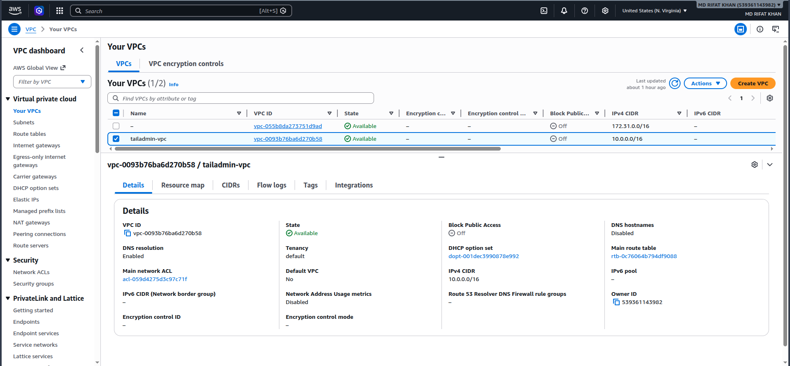

### Route Tables

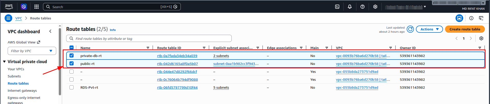

### Public Subnet

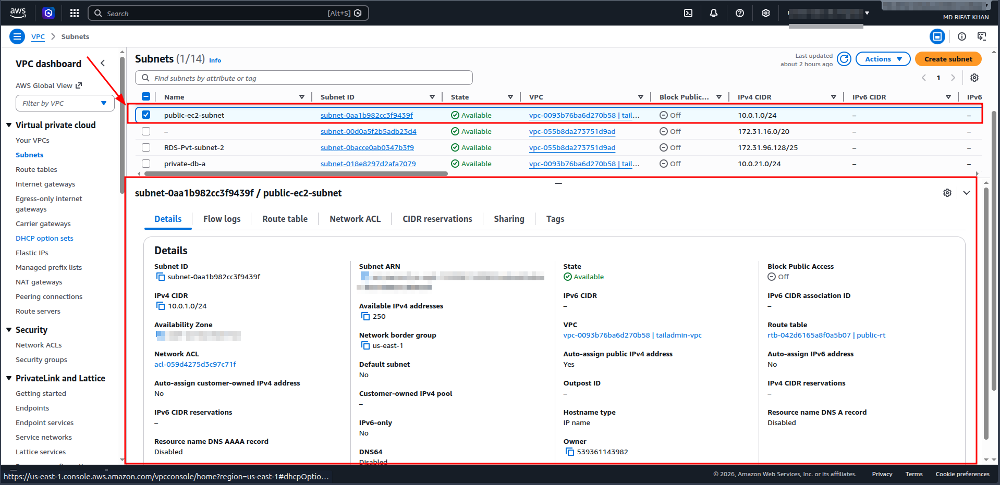

### Private Subnets

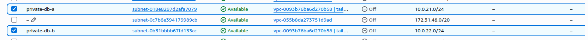

---

## Route Tables

### Public Route Table

```text
0.0.0.0/0 → Internet Gateway
```

Purpose:
- public internet access
- ECR access
- package downloads

---

# Security Groups

## EC2 Security Group

| Port | Purpose |
|---|---|
| 22 | SSH Access |
| 80 | HTTP Traffic |

### EC2 Security Group

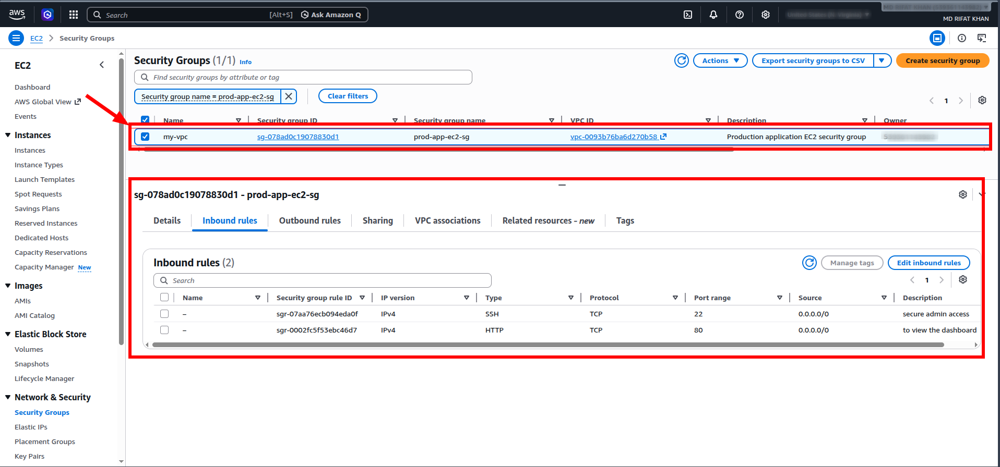

---

## RDS Security Group

| Port | Source |
|---|---|
| 3306 | EC2 Security Group Only |

Database is NOT publicly accessible.

### RDS Security Group

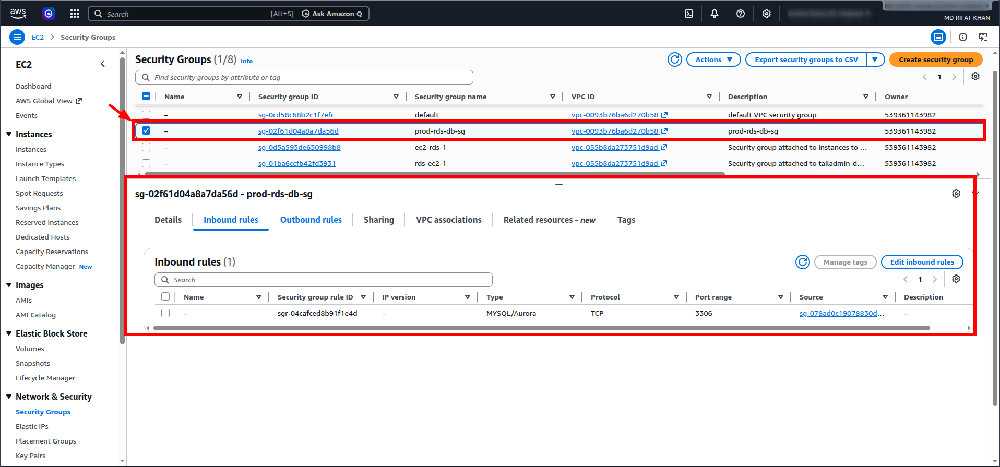

---

# EC2 Application Server

The Laravel application is hosted on an Ubuntu EC2 instance inside a public subnet.

Current public endpoint:

```text
http://100.54.0.92
```

Use this URL to view the application output.

The server contains:
- Docker runtime
- Nginx reverse proxy
- GitHub Actions deployment target
- Blue/Green deployment containers

### EC2 Instance

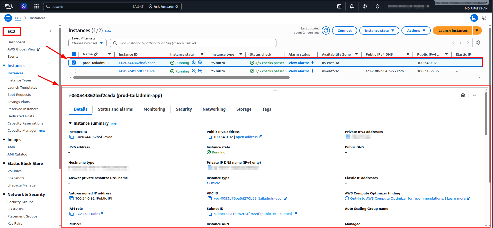

---

# Docker Architecture

## Container Runtime

The Laravel application runs inside Docker containers.

### Runtime Stack

- Apache
- PHP 8.3
- Laravel
- Node/Vite frontend assets

### Amazon ECR Repository

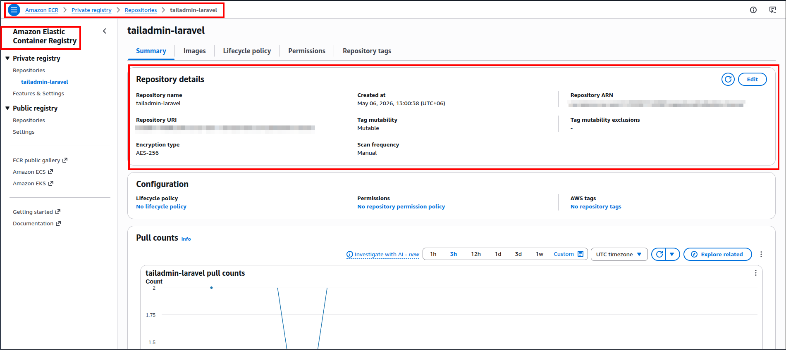

---

# Blue/Green Deployment Strategy

Application uses Blue/Green deployment:

| Environment | Port |
|---|---|
| Blue | 8081 |
| Green | 8082 |

Nginx dynamically switches traffic between environments after:
- successful deployment
- health validation
- migration completion

Benefits:
- near zero downtime deployments
- rollback support
- safer releases

### Blue/Green Deployment


---

# CI/CD Workflow

## GitHub Actions Pipeline

### Build Stage

Pipeline performs:

- Node dependency installation
- Frontend asset compilation
- Composer dependency installation
- Laravel optimization
- Unit testing
- Docker image build
- Trivy security scanning
- Docker image push to Amazon ECR

---

## Deployment Stage

Deployment performs:

- SSH into EC2
- Pull latest Docker image
- Detect active environment
- Deploy new Blue/Green container
- Run Laravel migrations
- Perform health checks
- Switch Nginx traffic
- Remove old container
- Cleanup unused images

### Successful Deployment

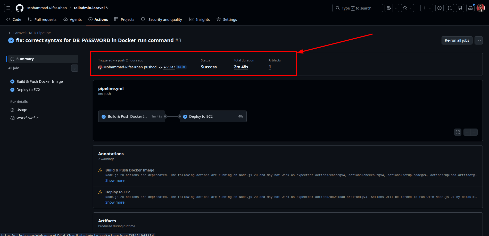

---

# Docker Image Strategy

Images are tagged using Git commit SHA.

Example:

```text
tailadmin-laravel:9c75f47
```

Benefits:
- immutable deployments
- rollback capability
- deployment traceability

---

# IAM Security Model

## EC2 IAM Role

EC2 uses IAM Role-based authentication instead of hardcoded credentials.

Attached policies include:

| Policy | Purpose |
|---|---|
| AmazonEC2ContainerRegistryReadOnly | Pull images from ECR |
| AmazonSSMManagedInstanceCore | SSM Access |
| SecretsManagerReadWrite | Access Secrets Manager |
| CloudWatchAgentServerPolicy | Monitoring Support |

### IAM Role Configuration

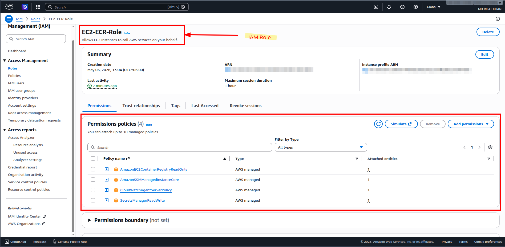

---

# Secrets Management

## Current Runtime Secrets

Current deployment uses:
- GitHub Secrets
- runtime environment injection

Used for:
- Database credentials
- AWS credentials

---

### AWS Secrets Manager

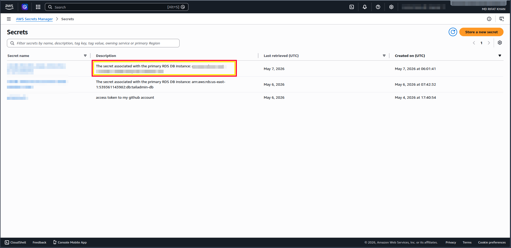

---

# Database Architecture

## Amazon RDS MySQL

Database runs on:
- private subnets
- isolated networking
- restricted security group access

Benefits:
- managed backups
- managed patching
- network isolation
- improved security

### RDS MySQL Instance

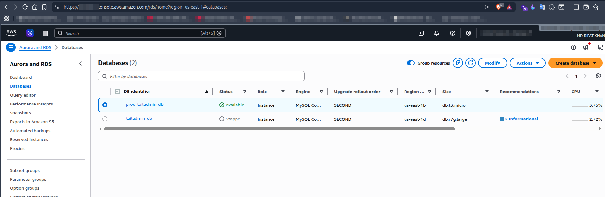

---

# Disaster Recovery

## Cross-Region Backup Strategy

Configured:
- automated RDS backups
- cross-region backup support

Failover was intentionally not implemented as per assignment scope.

### Automated Backup Configuration

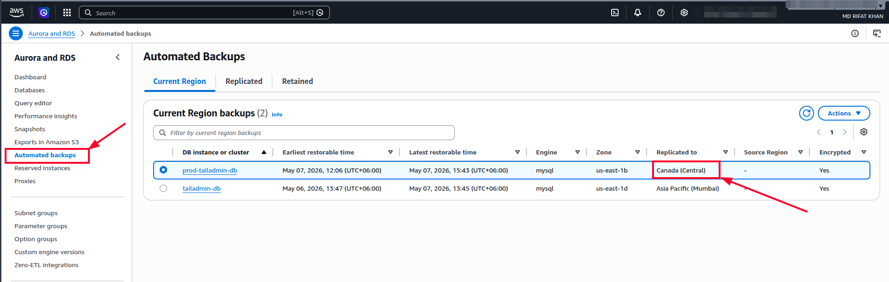

---

# Nginx Reverse Proxy

Nginx acts as reverse proxy:

```text
Internet / http://100.54.0.92
↓
Nginx :80
↓
Docker Container :8081 / :8082
```

Benefits:
- traffic switching
- deployment abstraction
- reverse proxy control

# AWS CodePipeline Support

The project also contains:
- `buildspec.yml`
- `appspec.yml`
- deployment lifecycle scripts

Prepared for future migration to:
- AWS CodeBuild
- AWS CodeDeploy
- AWS CodePipeline

Current production deployment still uses:

```text
GitHub Actions as primary CI/CD
```

for simplicity and flexibility.

---

# Deployment Scripts

## Included Scripts

| Script | Purpose |
|---|---|
| `before_install.sh` | Cleanup & preparation |
| `after_install.sh` | Runtime setup |
| `application_start.sh` | Blue/Green deployment |
| `validate.sh` | Health validation |

---

# Security Considerations

Implemented:
- IAM role-based authentication
- Private RDS networking
- Security Group isolation
- Docker image scanning
- No hardcoded AWS credentials on EC2
- Restricted database access
- SSH public key authentication

---

# SSH Access Requirement

Additional user configured using provided SSH public key:

Completed: a user was added to the server for the provided SSH key.

```text
ssh-ed25519 AAAAC3NzaC1lZDI1NTE5AAAAICV/wCuwCL2hgXodxQBFcyJd/rurJfo+Gl90QVu5AL2M
```

Configured through:

```text
~/.ssh/authorized_keys
```

with proper Linux permissions.

---